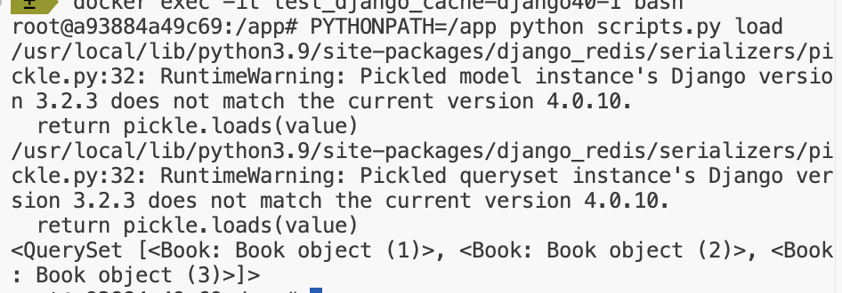
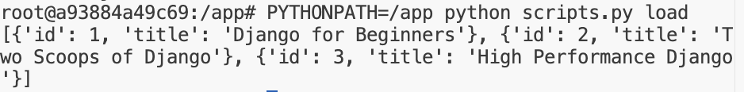

# Desription
* django 3.2 와 django 4.0 에서 캐시 테스트
* django 3.2에서 캐싱 하고, django 4.0에서 캐시 불러왔을 때 발생하는 문제


# 환경 세팅
```
docker-compose up -d
docker exec -it test_django_cache-django32-1 bash
PYTHONPATH=/app python manage.py makemigrations
PYTHONPATH=/app python manage.py migrate
PYTHONPATH=/app python initial_data.py
```

# 캐시 테스트

## 쿼리셋 캐시 저장
### django 3.2 에서 캐시 저장
```
docker exec -it test_django_cache-django32-1 bash
PYTHONPATH=/app python scripts.py save_qs
``` 

### django 4.0 에서 캐시 불러오기
```
docker exec -it test_django_cache-django40-1 bash
PYTHONPATH=/app python scripts.py load
```

## 리스트 캐시 저장
### django 3.2 에서 캐시 저장
```
docker exec -it test_django_cache-django32-1 bash
PYTHONPATH=/app python scripts.py save_list
```

### django 4.0 에서 캐시 불러오기
```
docker exec -it test_django_cache-django40-1 bash
PYTHONPATH=/app python scripts.py load
```


# 캐시 테스트 결과

## 쿼리셋 캐시 테스트


## 리스트 캐시 테스트



